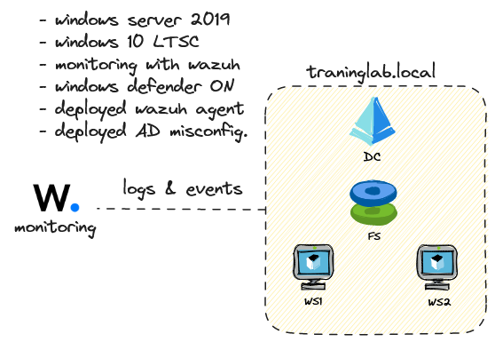

# Automated AD Training Lab
This is a simple way to deploy a minimal active directory lab environment on Proxmox.

*just another automated Active Directory lab and not much more*

### Prerequisite
1. a Proxmox server
2. sufficient space on `local-lvm` (~200GB)
3. an api token to interact with Proxmox:
```bash
# run on proxmox server shell
pveum role add provisioner -privs "Datastore.AllocateSpace Datastore.Audit Pool.Allocate SDN.Use Sys.Audit Sys.Console Sys.Modify VM.Allocate VM.Audit VM.Clone VM.Config.CDROM VM.Config.Cloudinit VM.Config.CPU VM.Config.Disk VM.Config.HWType VM.Config.Memory VM.Config.Network VM.Config.Options VM.Migrate VM.Monitor VM.PowerMgmt"
pveum user add userprovisioner@pve
pveum aclmod / -user userprovisioner@pve -role provisioner
pveum user token add userprovisioner@pve provisioner-token --privsep=0
pveum aclmod /storage/local --user userprovisioner@pve --role PVEDatastoreAdmin --token userprovisioner@pve\!provisioner-token  # -> required for iso upload...
# make sure to save the output
```


### Deployment
1. Create a VM inside your Proxmox hosts and ssh into it
2. `git clone <repo>` 
3. `cd <repo>`
4. `chmod +x requirements.sh && sudo ./requirements.sh`
5. then run the `task_templating.sh` script in `packer/`
6. and `task_terraforming.sh` script in `terraform/`
7. finally, inside `ansible/` run `ansible-playbook main.yml`
8. Enjoy :crossed_fingers:

*BONUS: check the files and modify network or storage name if needed.
The lab is currently deployed on storage **local-lvm** and network **vmbr1**.*

### Why another automated lab?

- I am always looking for new technologies to learn, and this one has caught my attention and satisfied my curiosity the most. The possibilities that this technology offers are endless, so... *why not?*

- Usually I spend time developing active directory lab environment to test, understand and evaluate actions related to red teaming stuff (or whatever). Since I like automating everything I decided to focus more on creating a fully automated and potentially scalable solution... ready to welcome your implants and log your actions.

*seriously, I just want to learn packer + terraform + ansible stuff*

### Infrastructure
The infrastructure is designed to be simple and use few resources in its basic configuration, you can add as many VMs per "type" as you like, or increase the complexity of the environment by duplicating VMs and trusting the two DCs. 



- **Monitoring Server:** Ubuntu-based server with docker, docker-compose and wazuh-docker deployed.

- **DC**: Windows Server 2019 with AD roles installed.

- **FS:** Windows Server 2019 server with FS-FileServer role installed.

- **WS1 & WS2:** Windows 10 Enterprise LTSC workstations.

### Download necessary ISOs
Download directly into *proxmox web ui -> local storage -> ISO templates -> download from url*

- ubuntu -> https://releases.ubuntu.com/22.04.3/ubuntu-22.04.3-live-server-amd64.iso
- win10 -> https://go.microsoft.com/fwlink/p/?LinkID=2208844&clcid=0x409&culture=en-us&country=US
- win2019 -> https://go.microsoft.com/fwlink/p/?LinkID=2195167&clcid=0x409&culture=en-us&country=US
- virtio driver -> https://fedorapeople.org/groups/virt/virtio-win/direct-downloads/latest-virtio/virtio-win.iso

You must create the autounattend-winXXX.iso files to deploy windows correctly, ~~i think there's no other solution to use autounattend.xml files (with proxmox)~~ (RTFM!). Follow the scripts instructions.

### Credentials
Below are the default credentials used in the environment:

| Resources            | Username      | Password              |
|----------------------|---------------|-----------------------|
| Windows hosts        | Administrator | Deploy123.          |
| Monitoring Server    | ubuntu        | ubuntu                |
| Wazuh                | admin         | SecretPassword        |
| Domain Administrator | Administrator | DomainAdminPassword.  |
| Provision User       | provision     | ProvisionPassword.    |


***Obviously it's not intended to be a SAFE environment.***

### TODO
- [x] remove the manually-iso-uploads part, i found the way.
- [ ] i know, the ansible part needs some improvement, i'm working on it.
- [ ] add a windows 2022 server and windows 11 templates.

### Acknowledgments
- [Packer Plugin for Windows Update](https://github.com/rgl/packer-plugin-windows-update): An indispensable plugin for managing the operating system update before creating the template.
- [SecLab by mttaggart](https://github.com/mttaggart/seclab): An impressive repository and a person absolutely worth following. It inspired me to create something of my own.
- [packer-windows by StefanScherer](https://github.com/StefanScherer/packer-windows): packer + windows = StefanScherer repo.
- [vulnerable-AD by WazeHell](https://github.com/WazeHell/vulnerable-AD): This script outlines vulnerabilities and misconfigurations in an Active Directory environment, making it perfect for the intended purpose.


Thank you to the creators and contributors of these projects for their invaluable resources and inspiration.